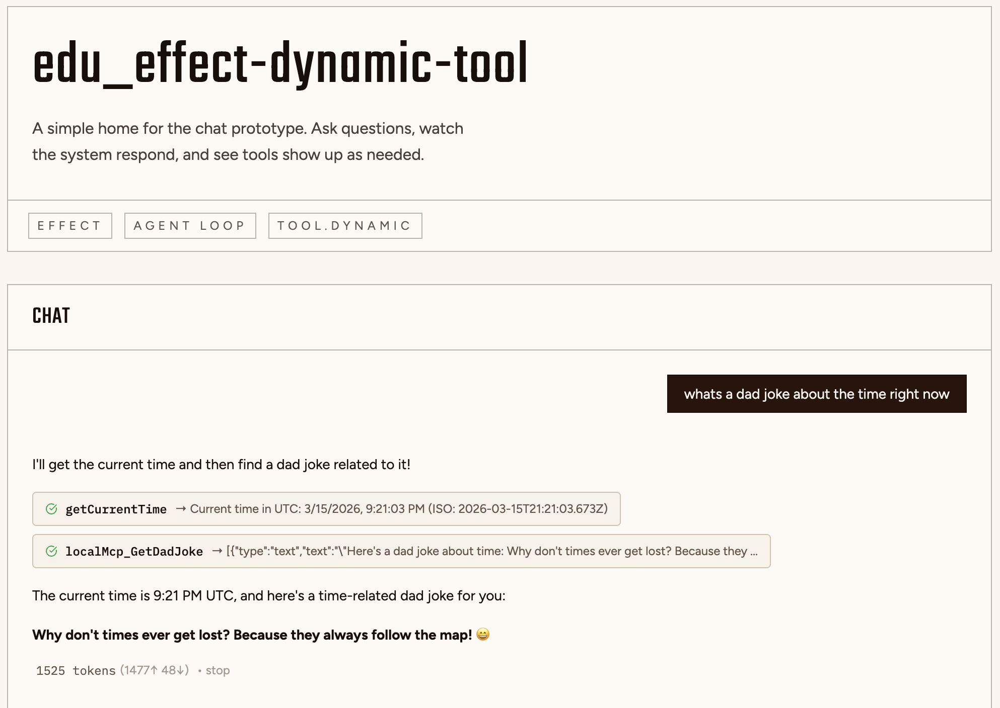

# edu_effect-dynamic-tool



Experimental, educational repo for prototyping Effect v4 beta
`Tool.dynamic` with MCP. The proof of concept: create a local MCP server
(`server-mcp`) and fetch tools from it without explicitly declaring schemas.
The same flow works with an external MCP server.

## What this repo demonstrates

- Local MCP server that advertises tools dynamically
- Client/server wiring that discovers tools without explicit schemas
- External MCP discovery using the same approach

## Quick Start

```bash
# Install dependencies
bun install

# Start development
bun dev

# Start only the MCP server
bun dev --filter=server-mcp
```

## How the POC is organized

- `apps/server-mcp` exposes MCP tools via Effect v4 beta `Tool.dynamic`
- `apps/server` and/or `apps/client` consume discovered tools
- `packages/domain` holds shared schemas and types

## Project Structure

```txt
.
├── apps/
│   ├── client/             # React frontend (Vite + React)
│   ├── server/             # Bun + Effect backend API
│   └── server-mcp/         # Model Context Protocol server
├── packages/
│   ├── config-typescript/  # TypeScript configurations
│   └── domain/             # Shared Schema definitions
├── docker-compose.yaml     # Optional local deployment
├── package.json            # Root package.json with workspaces
└── turbo.json              # Turborepo configuration
```

## Learn More

- [Effect](https://effect.website/docs/introduction)
- [Model Context Protocol](https://modelcontextprotocol.io/)
